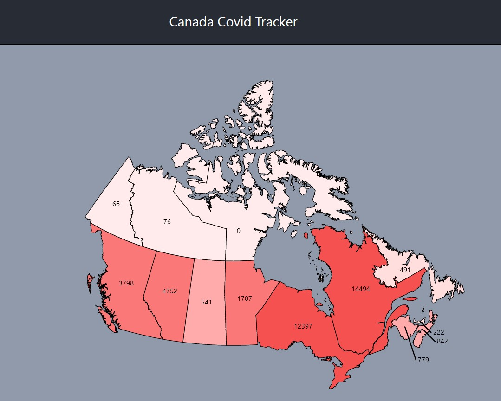
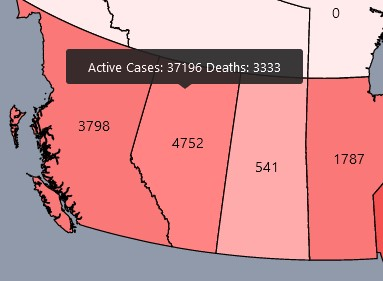

## Canada Covid Tracker

A simple app visually displaying COVID-19 daily reported cases and active cases/cumulative deaths for Canada.

This project was bootstrapped with [Create React App](https://github.com/facebook/create-react-app).\
\
[React Simple Maps](https://www.react-simple-maps.io/) and [React Tooltip](https://github.com/wwayne/react-tooltip) provide map visualization and basic tooltip functionality.\
All COVID-19 data is pulled from the [COVID-19 Canada Open Data Working Group dataset](https://opencovid.ca/api/)

### Potential Improvements
- Improve interface for better visual presentation
- Condense JSX code for map rendering (can improve certain functions)
- Provide additional COVID-19 stats in enhanced tooltip or table
